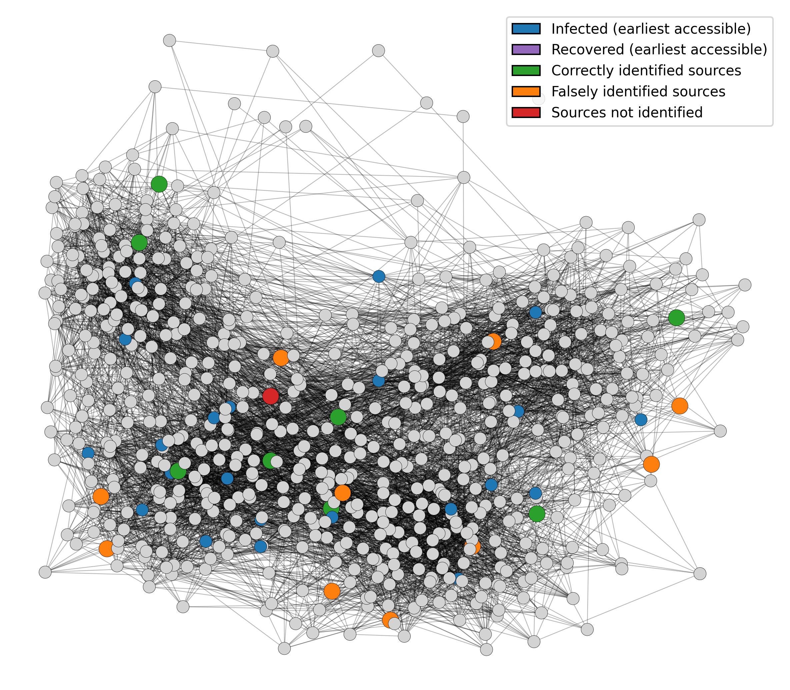

# Conformalized Network Source Detection

## About the Project

This is the official implementation of the paper *Conformal Prediction for Multi-Source Detection on a Network*. The target is to privide confident detection of information propagation sources on a network.



## Getting Started

### Environmental Setup

Initiate the environment:

```conda create -n [env_name] python=3.8.20```

(Optional) install `cudatoolkit` to ensure compatibility:

```conda install -c conda-forge cudatoolkit=10.1.243```

Install required packages:

```pip install -r requirements.txt```

### Data Preparation

Run the command

```
cd SD-STGCN/output/test_res
python data_prepare.py --combine 1 --split 0
cd ../../../
nohup ./batch_CP_process_loaddata.sh > /dev/null 2>&1 &
```
Before the first time of executing the `.sh` file, run the following command to make it executable:
```
chmod +x batch_CP_process_loaddata.sh
```

**Remark**: `data_prepare.py` only combines the already generated data into one file to facilitate the subsequent steps.
if you want to use the simulator here to generate data from scratch, use the following command:
```
cd SD-STGCN/dataset/<graph_name>/code
./run_entire_mix_random.sh <number of sampled time frames> <number of samples> <propagation model> <smallest number of sources> <largest number of sources> <smallest R0> <largest R0> <smallest gamma> <largest gamma> <first available instance>
```
Example:
```
cd SD-STGCN/dataset/highSchool/code
./run_entire_mix_random.sh 16 21200 SIR 1 15 1 15 0.1 0.4 2
```

## Implementation

Example: SIR simulations with 10 sources on the highSchool network
```
python main.py --graph highSchool --train_exp_name SIR_nsrc10_Rzero43.44_beta0.25_gamma0.15_T30_ls21200_nf16 --test_exp_name SIR_nsrc10_Rzero43.44_beta0.25_gamma0.15_T30_ls8000_nf16 --pow_expected 0.5 --prop_model SIR --set_recall 1 --set_prec 1 --ArbiTree_CQC 1 > logfiles/runCPSIR10pow5.log 2>&1
```
See `batch_CP_process.sh` and `batch_CP_process_SI1.sh` for a complete list of commands to reproduce the experiments.

## Visualization

```python visualization.py --sample_index 6```

## Acknowledgements

The `DSI` module is derived from the [source code](https://github.com/lab-sigma/Diffusion-Source-Identification) of the existing work

Dawkins, Q. E.; Li, T.; and Xu, H. 2021. Diffusion source identification on networks with statistical confidence. In ICML.


The `SD-STGCN` module is derived from the [source code](https://github.com/anonymous-anuthor/SD-STGCN) of the existing work

Sha, H.; Al Hasan, M.; and Mohler, G. 2021. Source detection on networks using spatial temporal graph convolutional
networks. In IEEE International Conference on Data Science and Advanced Analytics (DSAA).